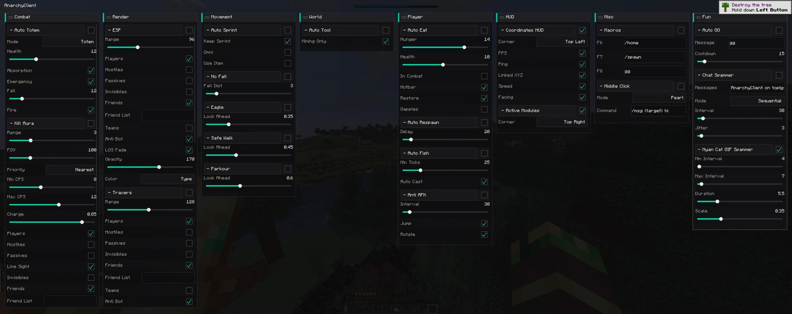

# AnarchyClient

[](https://github.com/6b6t/AnarchyClient/actions/workflows/ci.yml)
[](LICENSE)

Fabric `26.2` utility mod for 6b6t.

> [!NOTE]
> This is a fun side project by the 6b6t team, not an official product. It comes with no support guarantees. Use it at your own risk.

## Demo

Preview of how it looks in-game.



## Features

- Custom, unique in-game GUI built on a tailored Rivet interface for fast, consistent module control.
- Vulkan and OpenGL renderer support through Blaze3D.
- Gameplay focus modules: `KillAura`, `AutoTotem`, `AutoArmor`, and `AutoSprint` for combat/survival flow; `Parkour`, `NoFall`, `SafeWalk`, and `AutoEat` for movement and player consistency; `Tracers`, `ESP`/`StorageEsp`/`ItemEsp`, `CoordinatesHud`, `ActiveModulesHud`, and `HudText` for awareness and visual feedback.

## How to use 

1. Grab the latest Fabric .jar from https://github.com/6b6t/AnarchyClient/releases/latest
2. Put in your Fabric `minecraft/mods` folder.
3. Join a world
4. Open with Right-Shift click (keybind configurable in Minecraft keybind settings)

## Development

```bash
./gradlew build
./gradlew runClient
```

The client menu opens with `Right Shift`. Rivet is pulled from `com.github.Lenni0451.rivet:core:8dfcc3dd17`; upstream source is available at `https://github.com/Lenni0451/rivet`.

## License

[MIT](LICENSE)
